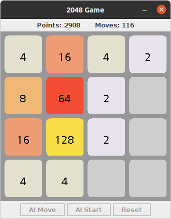

# 2048 Game AI
This is an AI which attempts to solve the popular 2048 Game. 
The AI uses a **depth-limited tree search** to choose the optimal move.
## Screenshots
The Game:

## Running
### With IntelliJ
The code has been written in [Kotlin](https://kotlinlang.org) and uses the [IntelliJ](https://www.jetbrains.com/idea/) to run.
If you have IntelliJ (Community or Ultimate) installed, you can directly
open this project from the File menu: `File -> New -> Project from Version Control` and paste in `https://github.com/RedDocMD/2048Game` for the URL.
You can also clone this repo with `git clone https://github.com/RedDocMD/2048Game` and open it in IntelliJ.

### As a JAR file
Alternatively, if you have Java 8 or higher installed, you can download the JAR file from [here](https://github.com/RedDocMD/2048Game/releases/tag/1.1).
Then run it as `java -jar 2048Game.jar`.

## Running the AI
The AI can be run by pressing the `AI Start` button. Grab a coffee and watch the AI chug through the game. :)